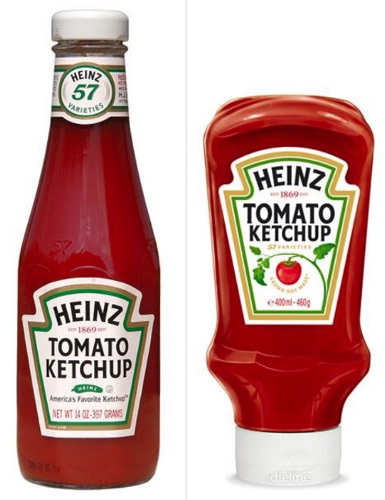
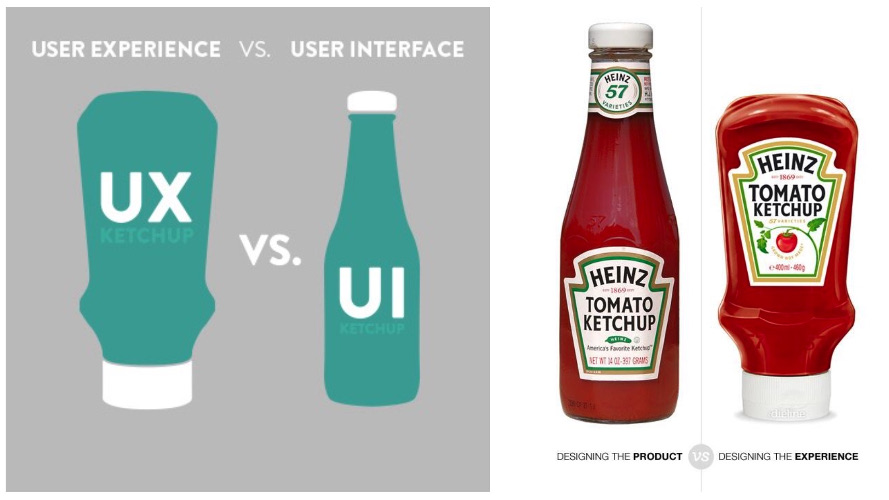
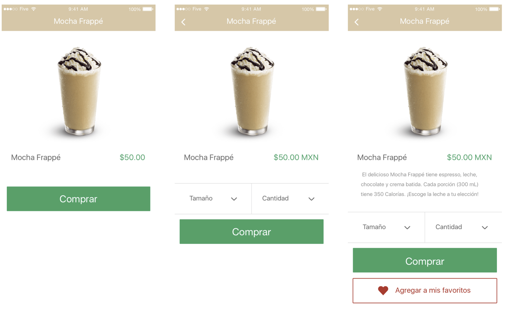
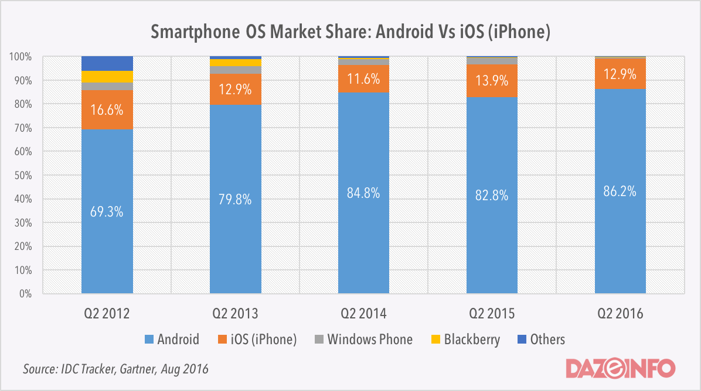
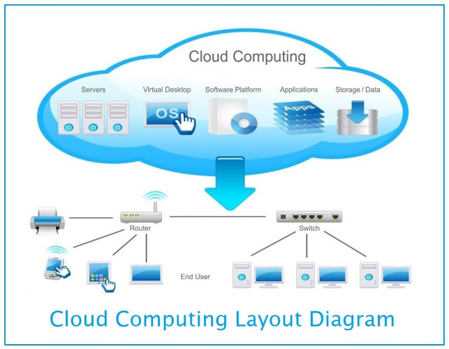
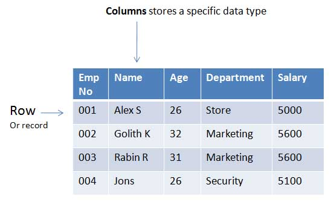
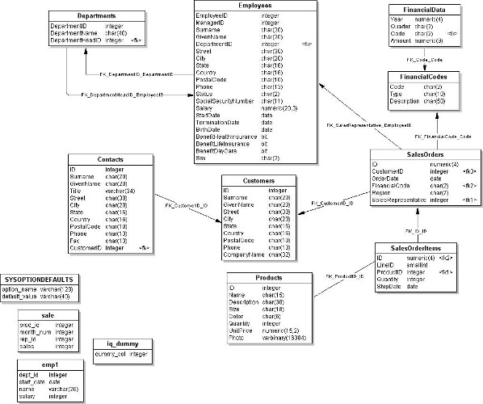
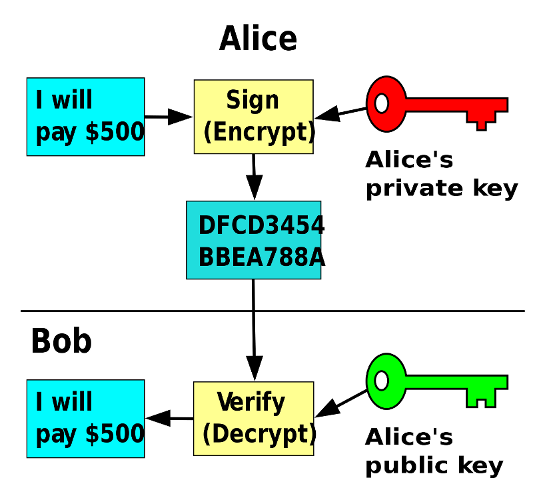

<!-- $theme: gaia -->

# :iphone: Desarrollo de Apps

:man: **Javier Rizzo Aguirre**
:computer: [javierrizzo.com](http://javierrizzo.com/)
:envelope: [javierrizzoa@gmail.com](mailto:javierrizzoa@gmail.com)

---

## :bulb: El app

> Uber de limpieza y mantenimiento.

---

## :question: ¿Qué se necesita?

* :rainbow: UX + UI
* :iphone: Desarrollo del app
* :cloud: Servidores
* :books: Bases de datos
* :closed_lock_with_key: Seguridad

---

<!-- *template: invert -->

## :rainbow: UX + UI

---

### :tomato: Un ejemplo sencillo

---

### :tomato: Producto=UI :heart_eyes: Experiencia=UX

---

### :art: UI | :nut_and_bolt: Usabilidad | :heart_eyes: UX

---

<!-- *template: invert -->

## :iphone: Desarrollo del app

---

### :bar_chart: Market Share

---

### :apple: iOS

* :moneybag: $100 USD anuales.
* :mag: Aprobación lenta y difícil.
* :computer: Mac
* :iphone: iPhone, iPad, iPod.
* :speech_balloon: Xcode (Swift, Objective-C)

---

### :space_invader: Android

* :moneybag: $25 USD, un solo pago.
* :mag: Aprobación rápida.
* :computer: Windows, Mac, GNU/Linux.
* :iphone: Android, emulador.
* :speech_balloon: Android Studio o Eclipse ADT (Java, C/C++)

---

### :speech_balloon: Otros frameworks

* Xamarin (C#)
* Phonegap (JS)
* Ionic (JS+Angular)
* React Native (JS+React)

---

<!-- *template: invert -->

## :cloud: Servidores

---

### :cloud::computer: La nube=Muchas computadoras

---

### :computer: VPS (Virtual Private Server)

* Memoria
* Procesador
* Disco
* Transferencia

---

### :1234: Principales proveedores

* AWS (Amazon)
* DigitalOcean
* Linode
* Heroku

&nbsp;

* Tu propio servidor

---

### :moneybag: Precios

---

<!-- *template: invert -->

## :books: Bases de datos

---

### :book: Tablas de Bases de Datos

---

### :twisted_rightwards_arrows: Bases de datos relacionales

---

### :1234: Principales alternativas

* MySQL
* MS SQL Server
* PostgreSQL
* MongoDB
* MariaDB
* Oracle

--- 

<!-- *template: invert -->

## :closed_lock_with_key: Seguridad

---

### :lock: :speech_balloon: Criptografía

---

### :lock::man: Seguridad para el cliente

* Phishing
* Man in the middle attack
* Sniffing

---

### :lock::cloud: Seguridad para el servidor

* Penetration
* Xploits
* DoS/DDos

---

<!-- *template: gaia -->

## :wave: Gracias

Este trabajo está distribuido bajo una licencia [Creative Commons Attribution-ShareAlike 4.0 International Licence](https://creativecommons.org/licenses/by-sa/4.0/).

Puedes encontrar más información y una copia de este documento en https://javierrizzo.com/2017/desarrollo-apps/.